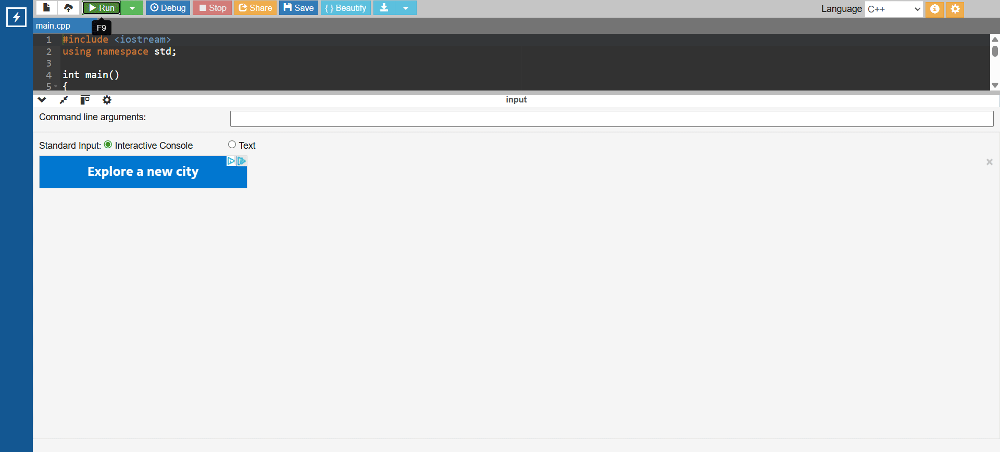

# G.O.A.T Tracker

The “G.O.A.T Tracker” is a C++ program that evaluates a quarterback’s passing yards for a single season and compares the result to the top 15 passing seasons in NFL history. Using a structured series of if/else statements, the program determines ranking, identifies ties with historical performances, and provides contextual feedback.

---

## Project Overview

This project demonstrates conditional logic, user input handling, and output formatting. It was designed as an interactive tool for sports fans to explore how a statistical performance compares to all-time great seasons.

The concept could also be applied to sports video games to provide deeper context during record-breaking achievements, something many current titles do not fully implement. In a larger-scale implementation, such as integration into a game system, this logic would be refactored into a data-driven structure (e.g., arrays or structs) to support scalability, easier updates, and expanded statistical categories. The current implementation prioritizes clarity and explicit logic, making it well-suited for demonstrating foundational programming concepts.

---

## Demo

The demo shows how the program responds to different inputs:
- **4704 yards** → Outside top 15 range  
- **5300 yards** → Ranked between historical players  
- **6000 yards** → Breaks all records (G.O.A.T output)

---

## Real-World Comparison

Modern sports games such as EA Sports College Football 25 often display record-breaking achievements, but typically only highlight milestone records (such as first place) rather than showing full movement within the record rankings.

They also do not provide detailed breakdowns of how a performance compares to other historical results.

This project expands on that idea by explicitly showing where a given performance ranks among historical values, including the players immediately ahead and behind, creating a clearer sense of progression and context.

---

## Screenshot Example

---

## Code

#include <iostream>
using namespace std;

int main()
{ 
    int yards;
    char again;

    do {
        cout << "-----------------------------" << endl;
        cout << "      G.O.A.T Tracker        " << endl;
        cout << "-----------------------------" << endl;

        cout << "\nEnter your passing yards for this season: ";
        cin >> yards;

        // Handles non-number input
        if (cin.fail()) {
            cout << "Invalid input. Please enter a number." << endl;
            cin.clear();
            cin.ignore(1000, '\n');
            continue;
        }

        // Input validation
        if (yards < 0) {
            cout << "Invalid input. Yards cannot be negative." << endl;
            continue;
        }

        else if (yards > 5477)
            cout << "You had the greatest passing season of all time!" << endl
                 << "Congratulations! You are the G.O.A.T!" << endl;

        else if (yards == 5477)
            cout << "You are tied for the greatest season of all time with Hall of Famer Peyton Manning." << endl;

        else if (yards == 5476)
            cout << "You are tied for the second best season of all time with Hall of Famer Drew Brees." << endl;

        else if (yards < 5476 && yards > 5316)
            cout << "You had the third greatest season of all time." << endl
                 << "You are ahead of Tom Brady and behind Drew Brees." << endl;

        else if (yards == 5316)
            cout << "You are tied for the third greatest season of all time with seven-time Super Bowl Champion Tom Brady." << endl;

        else if (yards < 5316 && yards > 5250)
            cout << "You had the fourth greatest season of all time." << endl
                 << "You are ahead of Patrick Mahomes and behind Tom Brady." << endl;

        else if (yards == 5250)
            cout << "You are tied for the fourth greatest season of all time with three-time Super Bowl Champion Patrick Mahomes." << endl;

        else if (yards < 5250 && yards > 5235)
            cout << "You had the fifth greatest season of all time." << endl
                 << "You are ahead of Tom Brady's second best season and behind Patrick Mahomes." << endl;

        else if (yards == 5235)
            cout << "You are tied for the fifth greatest season of all time with seven-time Super Bowl Champion Tom Brady." << endl;

        else if (yards < 5235 && yards > 5208)
            cout << "You had the sixth greatest season of all time." << endl
                 << "You are ahead of Drew Brees' second best season and behind Tom Brady's second best season." << endl;

        else if (yards == 5208)
            cout << "You are tied for the sixth greatest season of all time with Hall of Famer Drew Brees." << endl;

        else if (yards < 5208 && yards > 5177)
            cout << "You had the seventh greatest season of all time." << endl
                 << "You are behind Drew Brees' second best season and ahead of his third best season." << endl;

        else if (yards == 5177)
            cout << "You are tied for the seventh greatest season of all time with Hall of Famer Drew Brees." << endl;

        else if (yards < 5177 && yards > 5162)
            cout << "You had the eighth greatest season of all time." << endl
                 << "You are behind Drew Brees' third best season and ahead of his fourth best season." << endl;

        else if (yards == 5162)
            cout << "You are tied for the eighth greatest season of all time with Hall of Famer Drew Brees." << endl;

        else if (yards < 5162 && yards > 5129)
            cout << "You had the ninth greatest season of all time." << endl
                 << "You are ahead of Ben Roethlisberger and behind Drew Brees' fourth best season." << endl;

        else if (yards == 5129)
            cout << "You are tied for the ninth greatest season of all time with two-time Super Bowl Champion Ben Roethlisberger." << endl;

        else if (yards < 5129 && yards > 5109)
            cout << "You had the tenth greatest season of all time." << endl
                 << "You are ahead of Jameis Winston and behind Ben Roethlisberger." << endl;

        else if (yards == 5109)
            cout << "You are tied for the tenth greatest season of all time with Jameis Winston." << endl;

        else if (yards < 5109 && yards > 5097)
            cout << "You had the eleventh greatest season of all time." << endl
                 << "You are ahead of Patrick Mahomes' second best season and behind Jameis Winston." << endl;

        else if (yards == 5097)
            cout << "You are tied for the eleventh greatest season of all time with three-time Super Bowl MVP Patrick Mahomes' second best season." << endl;

        else if (yards < 5097 && yards > 5084)
            cout << "You had the twelfth greatest season of all time." << endl
                 << "You are ahead of Dan Marino and behind Patrick Mahomes' second best season." << endl;

        else if (yards == 5084)
            cout << "You are tied for the twelfth greatest season of all time with Hall of Famer Dan Marino." << endl;

        else if (yards < 5084 && yards > 5069)
            cout << "You had the thirteenth greatest season of all time." << endl
                 << "You are ahead of Drew Brees' fifth best season and behind Dan Marino." << endl;

        else if (yards == 5069)
            cout << "You are tied for the thirteenth greatest season of all time with Hall of Famer Drew Brees." << endl;

        else if (yards < 5069 && yards > 5038)
            cout << "You had the fourteenth greatest season of all time." << endl
                 << "You are ahead of Matthew Stafford and behind Drew Brees' fifth best season." << endl;

        else if (yards == 5038)
            cout << "You are tied for the fourteenth greatest season of all time with Super Bowl MVP Matthew Stafford." << endl;

        else if (yards < 5038 && yards > 5014)
            cout << "You had the fifteenth greatest season of all time." << endl
                 << "You are ahead of Justin Herbert and behind Matthew Stafford." << endl;

        else if (yards == 5014)
            cout << "You are tied for the fifteenth greatest season of all time with Justin Herbert." << endl;

        else
            cout << "You didn't have a top 15 season in football history. Sorry, you are not the G.O.A.T." << endl;

        cout << "\nWould you like to enter another season? (y/n): ";
        cin >> again;

        while (again != 'y' && again != 'Y' && again != 'n' && again != 'N') {
            cout << "Please enter y or n: ";
            cin >> again;
        }

    } while (again == 'y' || again == 'Y');

    cout << "\nThanks for using the G.O.A.T Tracker!" << endl;

    return 0;
}
