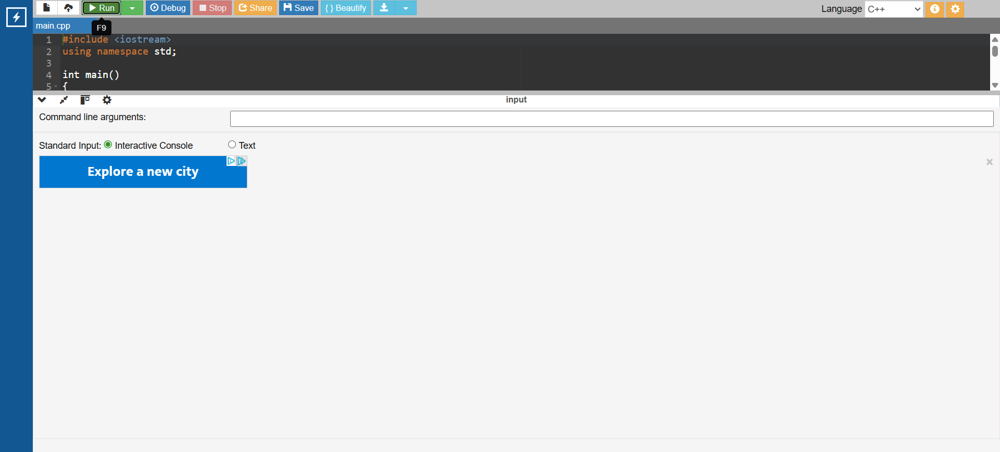

# G.O.A.T Tracker


---

## Overview

The “G.O.A.T Tracker” is a C++ program that evaluates a quarterback’s passing yards for a single season and compares the result to the top 15 passing seasons in NFL history. Using a structured series of if/else statements, the program determines ranking, identifies ties with historical performances, and provides contextual feedback.

This project demonstrates conditional logic, user input handling, and output formatting. It was designed as an interactive tool for sports fans to explore how a statistical performance compares to all-time great seasons.

The concept could also be applied to sports video games to provide deeper context during record-breaking achievements. In a larger-scale implementation, this logic would be refactored into a data-driven structure (such as arrays or structs) to improve scalability and maintainability. The current version prioritizes clarity and explicit logic for educational purposes.

---

## Demo



The demo shows how the program responds to different inputs:
- 4704 yards → Outside top 15 range  
- 5300 yards → Ranked within historical range  
- 6000 yards → Breaks all records (G.O.A.T output)

---

## Real-World Comparison

Modern sports games such as EA Sports College Football 26 often display record-breaking achievements, but typically only highlight milestone records rather than showing full ranking movement.

They also do not provide detailed breakdowns of how a performance compares to other historical results.

This project expands on that idea by explicitly showing where a given performance ranks among historical values, including the players immediately ahead and behind, creating clearer statistical context and progression visibility.

---

## Screenshot Example


---

## Code

```cpp
#include <iostream>
using namespace std;

int main()
{ 
    int yards;
    char again;

    do {
        cout << "-----------------------------" << endl;
        cout << "      G.O.A.T Tracker        " << endl;
        cout << "-----------------------------" << endl;

        cout << "\nEnter your passing yards for this season: ";
        cin >> yards;

        if (cin.fail()) {
            cout << "Invalid input. Please enter a number." << endl;
            cin.clear();
            cin.ignore(1000, '\n');
            continue;
        }

        if (yards < 0) {
            cout << "Invalid input. Yards cannot be negative." << endl;
            continue;
        }

        else if (yards > 5477)
            cout << "You had the greatest passing season of all time!" << endl
                 << "Congratulations! You are the G.O.A.T!" << endl;

        else if (yards == 5477)
            cout << "You are tied for the greatest season of all time with Peyton Manning." << endl;

        else if (yards == 5476)
            cout << "You are tied for second all-time with Drew Brees." << endl;

        else
            cout << "You did not rank in the top 15 seasons in NFL history." << endl;

        cout << "\nWould you like to enter another season? (y/n): ";
        cin >> again;

        while (again != 'y' && again != 'Y' && again != 'n' && again != 'N') {
            cout << "Please enter y or n: ";
            cin >> again;
        }

    } while (again == 'y' || again == 'Y');

    cout << "\nThanks for using the G.O.A.T Tracker!" << endl;

    return 0;
}
